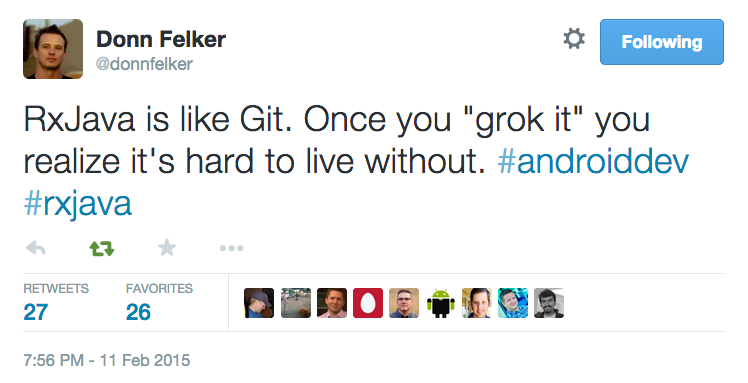

---

layout: ribbon

style: |

    #Cover h2 {
        margin:30px 0 0;
        color:#FFF;
        text-align:center;
        font-size:70px;
        }
    #Cover p {
        margin:10px 0 0;
        text-align:center;
        color:#FFF;
        font-style:italic;
        font-size:20px;
        }
        #Cover p a {
            color:#FFF;
            }
    #Picture h2 {
        color:#FFF;
        }
    #SeeMore h2 {
        font-size:100px
        }
    #SeeMore img {
        width:0.72em;
        height:0.72em;
        }
    .slide>div {
        padding-top:25px;
        height: 545px;
    }
    .slide pre code {
        line-height: 35px;
    }
    .slide.smallSize pre code {
        line-height: 25px;
        font-size: 18px;
    }
    .slide:after {
        background: none;
    }
    img[alt=marble] { width: 750px; }
    img[alt=right] { float: right; }
    .slide pre mark {
      padding-left: 0;
      padding-right: 0;
    }
    .slide pre mark.comment span {
      padding: 0;
      background: 0 0;
      color: #999;
    }
    #ego img {
      vertical-align: middle;
      margin-right: 4px;
    }
    #ego a {
      border-bottom: 0px;
      color: #666666;
    }
    .slide.top100 pre, .slide.top100 p { margin-top: 100px; }
    .slide.top120 pre, .slide.top120 p { margin-top: 120px; }
    .slide.top170 pre, .slide.top170 p { margin-top: 170px; }
---

# Introduction to Retrofit and RxJava {#Cover}

*Fabio Collini*

*Work in progress...*

<!-- photo by John Carey, fiftyfootshadows.net -->

## Ego slide

<a href="https://twitter.com/fabioCollini">@fabioCollini</a>

<a href="http://linkedin.com/in/fabiocollini">linkedin.com/in/fabiocollini</a>

<a href="http://www.folderorganizer.net/">Folder Organizer</a>

<a href="http://www.cosenonjaviste.it">cosenonjaviste.it</a>

<a href="http://nanabianca.it/">nana bianca</a>

<a href="http://freapp.com/">Freapp</a>

<a href="http://instal.com">instal.com</a>

<a href="https://play.google.com/store/apps/details?id=com.willitraintomorrow">Rain tomorrow?</a>

## Retrofit

- Turns your REST API into a Java interface
- Simple to use
- JSON conversion using Gson
- Custom converters
- Logging

## RxJava is not so simple...
{:.top100}

## HTTP request definition
{:.top170}

    public interface StackOverflowService {

      @GET("/users")
      UserResponse getTopUsers();

    }

## Service creation

    RestAdapter restAdapter = 
      new RestAdapter.Builder()

## Service creation

    RestAdapter restAdapter = 
      new RestAdapter.Builder()
      <mark>.setEndpoint("http://api.stackexchange.com/2.2/")</mark>

## Service creation

    RestAdapter restAdapter = 
      new RestAdapter.Builder()
      .setEndpoint("http://api.stackexchange.com/2.2/")
      <mark>.setRequestInterceptor(request -> {</mark>
        <mark>request.addQueryParam("site", "stackoverflow");</mark>
        <mark>request.addQueryParam("key", "...");</mark>
      <mark>})</mark>

## Service creation

    <mark>RestAdapter restAdapter</mark> = 
      new RestAdapter.Builder()
      .setEndpoint("http://api.stackexchange.com/2.2/")
      .setRequestInterceptor(request -> {
        request.addQueryParam("site", "stackoverflow");
        request.addQueryParam("key", "...");
      })
      <mark>.build();</mark>

## Service creation

    RestAdapter restAdapter = 
      new RestAdapter.Builder()
      .setEndpoint("http://api.stackexchange.com/2.2/")
      .setRequestInterceptor(request -> {
        request.addQueryParam("site", "stackoverflow");
        request.addQueryParam("key", "...");
      })
      .build();
    restAdapter.setLogLevel(<mark>LogLevel.BASIC</mark>);

## Service creation

    RestAdapter restAdapter = 
      new RestAdapter.Builder()
      .setEndpoint("http://api.stackexchange.com/2.2/")
      .setRequestInterceptor(request -> {
        request.addQueryParam("site", "stackoverflow");
        request.addQueryParam("key", "...");
      })
      .build();
    restAdapter.setLogLevel(RestAdapter.LogLevel.BASIC);
    <mark>StackOverflowService service = </mark>
      <mark>restAdapter.create(StackOverflowService.class);</mark>

## Synchronous request
{:.top120}

    private List<User> loadItemsSync() {
      List<User> users = 
        <mark>service.getTopUsers()</mark>.getItems();
      if (users.size() > 5) {
        users = users.subList(0, 5);
      }
      return users;
    }

## Request parameters
{:.top170}

    @GET("/users/{userId}/top-tags") 
    TagResponse getTags(@Path("userId") int userId);
  
    @GET("/users/{userId}/badges") 
    BadgeResponse getBadges(@Path("userId") int userId);

## Other annotations

- @GET, @POST, @PUT, @DELETE, @HEAD
- @Path
- @Query
- @QueryMap
- @Body
- @FormUrlEncoded
- @Field
- @Headers

## Composition

    List<User> users = service.<mark>getTopUsers</mark>().getItems();
    if (users.size() > 5) {
      users = users.subList(0, 5);
    }
    List<UserStats> statsList = new ArrayList<>();
    for (User user : users) {
      TagResponse tags = 
        service.<mark>getTags</mark>(user.getId());
      BadgeResponse badges = 
        service.<mark>getBadges</mark>(user.getId());
      statsList.add(new UserStats(user, 
        tags.getItems(), badges.getItems()));
    }
    return statsList;

## AsyncTask
{:.smallSize}

    new AsyncTask<Void, Void, List<User>>() {
      @Override 
      protected List<User> doInBackground(Void... p) {
        try {
          return <mark>loadItemsSync();</mark>
        } catch (Exception e) {
          return null;
        }
      }
      @Override
      protected void onPostExecute(List<User> users) {
        if (users != null) {
          <mark>adapter.addAll(users);</mark>
        } else {
          <mark>showError();</mark>
        }
      }
    }.execute();

## Synchronous request
{:.top120}

    public interface StackOverflowService {

      @GET("/users")
      <mark>UserResponse</mark> getTopUsers();

    }

## Callbacks
{:.top120}

    public interface StackOverflowService {

      @GET("/users") 
      void getTopUsers(<mark>Callback<UserResponse> callback</mark>);

    }

## Callbacks in action

    service.getTopUsers(new Callback<UserResponse>() {
      @Override public void success(
          UserResponse repoResponse, Response r) {
        <mark>List<User> users = repoResponse.getItems();</mark>
        <mark>if (users.size() > 5)</mark>
        <mark>  users = users.subList(0, 5);</mark>
        <mark>adapter.addAll(users);</mark>
      }
      @Override public void failure(RetrofitError e) {
        showError();
      }
    });

## Callbacks in action

    service.getTopUsers(new Callback<UserResponse>() {
      @Override public void success(
          UserResponse repoResponse, Response r) {
        List<User> users = repoResponse.getItems();
        if (users.size() > 5)
          users = users.subList(0, 5);
        adapter.addAll(users);
      }
      @Override public void failure(RetrofitError e) {
        <mark>showError();</mark>
      }
    });

## Callback hell
{:.smallSize}

    service.getBadges(userId, new Callback<BadgeResponse>() {
      @Override public void success(BadgeResponse badges, Response r) {
        service.getTags(userId, new Callback<TagResponse>() {
          @Override public void success(TagResponse tags, Response r) {
            callback.success(new UserStats(user, 
              tags.getItems(), badges.getItems()), r);
          }

          @Override public void failure(RetrofitError error) {
            callback.failure(error);
          }
        });
      }

      @Override public void failure(RetrofitError error) {
        callback.failure(error);
      }
    });

## Retrofit
{:.top120}

    public interface StackOverflowService {

      @GET("/users") 
      void getTopUsers(<mark>Callback<UserResponse> callback</mark>);

    }

## Retrofit + RxJava
{:.top120}

    public interface StackOverflowService {

      @GET("/users")
      <mark>Observable<UserResponse></mark> getTopUsers();

    }

## RxJava in action

    service
      .<mark>getTopUsers()</mark>
      .subscribe(new Action1<UserResponse>() {
        @Override public void call(UserResponse r) {
          <mark>adapter.addAll(r.getItems());</mark>
        }
      }, new Action1<Throwable>() {
        @Override public void call(Throwable t) {
          <mark>showError();</mark>
        }
      });

## Retrolambda
{:.top120}

    service
        .<mark>getTopUsers()</mark>
        .subscribe(
          r -> <mark>adapter.addAll(r.getItems())</mark>, 
          t -> <mark>showError()</mark>
        );

## Threading
{:.top120}

    service
        .getTopUsers()
        <mark>.subscribeOn(Schedulers.io())</mark>
        <mark>.observeOn(AndroidSchedulers.mainThread())</mark>
        .subscribe(
          r -> adapter.addAll(r.getItems()), 
          t -> showError()
        );

## subscribe
{:.top170}

    public final Subscription subscribe(
      final Action1<? super T> onNext, 
      final Action1<Throwable> onError) {
        //...
    }

## onNext | onError
{:.top120}

## onNext* (onComplete | onError)?
{:.top120}

## Observable creation

    Observable.just(1, 2, 3);

## Observable creation

    Observable.just(1, 2, 3);
    Observable.error(new IOException());

## Observable creation

    Observable.just(1, 2, 3);
    Observable.error(new IOException());
    Observable.interval(1, TimeUnit.SECONDS);

## Observable creation

    Observable.just(1, 2, 3);
    Observable.error(new IOException());
    Observable.interval(1, TimeUnit.SECONDS);

    Observable.create(subscriber -> {
      try {
        subscriber.onNext(createFirstValue());
        subscriber.onNext(createSecondValue());
        subscriber.onCompleted();
      } catch (Throwable t) {
        subscriber.onError(t);
      }
    });

## map
{:.top100}

## map

    service.getTopUsers()
      .subscribe(r -> adapter.addAll(r.getItems()));

## map

    service.getTopUsers()
      .subscribe(r -> adapter.addAll(r.getItems()));

    service.getTopUsers()
        <mark>.map(r -> r.getItems())</mark>
        .subscribe(items -> adapter.addAll(items));

## map

    service.getTopUsers()
      .subscribe(r -> adapter.addAll(r.getItems()));

    service.getTopUsers()
        .map(r -> r.getItems())
        .subscribe(items -> adapter.addAll(items));

    service.getTopUsers()
        .map(<mark>UserResponse::getItems</mark>)
        .subscribe(<mark>adapter::addAll</mark>);

## flatMap
{:.top100}

## flatMap

    <mark class="comment">private Observable<UserStats> loadRepoStats(</mark>
    <mark class="comment">    User user) {
    <mark class="comment">  return</mark> service.getTags(user.getId())
          .map(TagResponse::getItems)
    <mark class="comment">      .flatMap(tags -></mark>
    <mark class="comment">          service.getBadges(user.getId())</mark>
    <mark class="comment">              .map(BadgeResponse::getItems)</mark>
    <mark class="comment">              .map(badges -> </mark>
    <mark class="comment">                new UserStats(user, tags, badges)</mark>
    <mark class="comment">              )</mark>
    <mark class="comment">      );</mark>
    <mark class="comment">}</mark>

## flatMap

    <mark class="comment">private Observable<UserStats> loadRepoStats(</mark>
    <mark class="comment">    User user) {
    <mark class="comment">  return</mark> service.getTags(user.getId())
          .map(TagResponse::getItems)
          .flatMap(tags ->
    <mark class="comment">          service.getBadges(user.getId())</mark>
    <mark class="comment">              .map(BadgeResponse::getItems)</mark>
    <mark class="comment">              .map(badges -> </mark>
    <mark class="comment">                new UserStats(user, tags, badges)</mark>
    <mark class="comment">              )</mark>
          );
    <mark class="comment">}</mark>

## flatMap

    <mark class="comment">private Observable<UserStats> loadRepoStats(</mark>
    <mark class="comment">    User user) {
    <mark class="comment">  return</mark> service.getTags(user.getId())
          .map(TagResponse::getItems)
          .flatMap(tags ->
              service.getBadges(user.getId())
                  .map(BadgeResponse::getItems)
    <mark class="comment">              .map(badges -> </mark>
    <mark class="comment">                new UserStats(user, tags, badges)</mark>
    <mark class="comment">              )</mark>
          );
    <mark class="comment">}</mark>

## flatMap

    private Observable<UserStats> loadRepoStats(
        User user) {
      return service.<mark>getTags</mark>(user.getId())
          .map(TagResponse::getItems)
          .flatMap(tags ->
              service.<mark>getBadges</mark>(user.getId())
                  .map(BadgeResponse::getItems)
                  .map(badges -> 
                    new UserStats(user, tags, badges)
                  )
          );
    }

## flatMap
{:.top120}

    service
        .getTopUsers()

## flatMap
{:.top120}

    service
        .getTopUsers()
        .flatMap(r -> Observable.from(r.getItems()))

## flatMap
{:.top120}

    service
        .getTopUsers()
        .flatMapIterable(UserResponse::getItems)

## flatMap
{:.top120}

    service
        .getTopUsers()
        .flatMapIterable(UserResponse::getItems)
        .limit(5)

## flatMap
{:.top120}

    service
        .getTopUsers()
        .flatMapIterable(UserResponse::getItems)
        .limit(5)
        .flatMap(this::loadRepoStats)

## flatMap
{:.top120}

    service
        .getTopUsers()
        .flatMapIterable(UserResponse::getItems)
        .limit(5)
        .flatMap(this::loadRepoStats)
        .toList();

## flatMap source code
{:.top120}

    public final <R> Observable<R> flatMap(
          Func1<
            ? super T, 
            ? extends Observable<? extends R>
          > func) {
      <mark>return merge(map(func));</mark>
    }

## concatMap
{:.top100}

## concatMap source code
{:.top120}

    public final <R> Observable<R> concatMap(
          Func1<
            ? super T, 
            ? extends Observable<? extends R>
          > func) {
        <mark>return concat(map(func));</mark>
    }

## concatMap
{:.top120}

    service
        .getTopUsers()
        .flatMapIterable(UserResponse::getItems)
        .limit(5)
        .<mark>concatMap</mark>(this::loadRepoStats)
        .toList();

## zip

## flatMap -> zip
{:.top100}

    service.getTags(user.getId())
        .map(TagResponse::getItems)
        .flatMap(tags ->
            service.getBadges(user.getId())
                .map(BadgeResponse::getItems)
                .map(badges -> 
                  new UserStats(user, tags, badges)
                )
        );

## flatMap -> zip
{:.top100}

    Observable.zip(
        <mark class="comment">service.getTags(user.getId())</mark>
        <mark class="comment">  .map(TagResponse::getItems),</mark>
        <mark class="comment">service.getBadges(user.getId())</mark>
        <mark class="comment">  .map(BadgeResponse::getItems),</mark>
        <mark class="comment">(tags, badges) -> </mark>
        <mark class="comment">  new UserStats(user, tags, badges)</mark>
    );        

## flatMap -> zip
{:.top100}

    Observable.zip(
        <mark>service.getTags(user.getId())</mark>
        <mark>  .map(TagResponse::getItems),</mark>
        <mark class="comment">service.getBadges(user.getId())</mark>
        <mark class="comment">  .map(BadgeResponse::getItems),</mark>
        <mark class="comment">(tags, badges) -> </mark>
        <mark class="comment">  new UserStats(user, tags, badges)</mark>
    );        

## flatMap -> zip
{:.top100}

    Observable.zip(
        service.getTags(user.getId())
          .map(TagResponse::getItems),
        <mark>service.getBadges(user.getId())</mark>
        <mark>  .map(BadgeResponse::getItems),</mark>
        <mark class="comment">(tags, badges) -> </mark>
        <mark class="comment">  new UserStats(user, tags, badges)</mark>
    );        

## flatMap -> zip
{:.top100}

    Observable.zip(
        service.getTags(user.getId())
          .map(TagResponse::getItems),
        service.getBadges(user.getId())
          .map(BadgeResponse::getItems),
        <mark>(tags, badges) -> </mark>
        <mark>  new UserStats(user, tags, badges)</mark>
    );        

## flatMap -> zip
{:.top100}

    Observable.zip(
        service.<mark>getTags</mark>(user.getId())
          .map(TagResponse::getItems),
        service.<mark>getBadges</mark>(user.getId())
          .map(BadgeResponse::getItems),
        (tags, badges) -> 
          new UserStats(user, tags, badges)
    );        

## Subscription

    Observable
      .interval(1, TimeUnit.SECONDS)
      .timestamp()
      .subscribe(System.out::println);

## Subscription

    Subscription subscription = Observable
      .interval(1, TimeUnit.SECONDS)
      .timestamp()
      .subscribe(System.out::println);

    Thread.sleep(2500);

    subscription.unsubscribe();

## Subscription

    Subscription subscription = Observable
      .interval(1, TimeUnit.SECONDS)
      .timestamp()
      .subscribe(System.out::println);

    Thread.sleep(2500);

    subscription.unsubscribe();

Timestamped(timestampMillis = 1429360406807, value = 0)
Timestamped(timestampMillis = 1429360407805, value = 1)

## How many requests?

    Observable<List<User>> observable = 
      service.<mark>getTopUsers</mark>().map(UserResponse::getItems);

    Subscription s1 = observable.<mark>subscribe</mark>(
      System.out::println, Throwable::printStackTrace);
    Subscription s2 = observable.<mark>subscribe</mark>(
      System.out::println, Throwable::printStackTrace);

## replay

    Observable<List<User>> observable = 
      service.<mark>getTopUsers</mark>().map(UserResponse::getItems);

    ConnectableObservable<List<User>> replayObservable = 
      observable.<mark>replay(1)</mark>;

    Subscription s1 = replayObservable.subscribe(
      System.out::println, Throwable::printStackTrace);
    Subscription s2 = replayObservable.subscribe(
      System.out::println, Throwable::printStackTrace);

    Subscription s3 = replayObservable.<mark>connect</mark>();

## Activity lifecycle

    @Override public View onCreateView(...) {
      ...
      retainedFragment = RetainedFragment
        .getOrCreate(getActivity());

      if (retainedFragment.get() == null) {
        Observable<List<T>> observable = loadItems()
            .subscribeOn(Schedulers.io())
            .observeOn(AndroidSchedulers.mainThread());
        retainedFragment.bind(observable.replay(1));
      }
      ...
    }

## Activity lifecycle

    @Override public void onResume() {
      super.onResume();
      subscription = retainedFragment.get()
        .subscribe(
          this::showDataInList, 
          t -> showError()
        );
    }

    @Override public void onPause() {
      super.onPause();
      subscription.unsubscribe();
    }

## RetainedFragment
{:.smallSize}

    public class RetainedFragment<T> extends Fragment {
      private Subscription connectableSubscription = Subscriptions.empty();
      private ConnectableObservable<T> observable;
      public RetainedFragment() {
          <mark>setRetainInstance(true);</mark>
      }
      public void bind(ConnectableObservable<T> observable) {
          this.observable = observable;
          connectableSubscription = observable.connect();
      }
      @Override public void onDestroy() {
          super.onDestroy();
          connectableSubscription.unsubscribe();
      }
      public Observable<T> get() {
          return observable;
      }
    }    

## RetainedFragment
{:.smallSize}

    public class RetainedFragment<T> extends Fragment {
      private Subscription connectableSubscription = Subscriptions.empty();
      private ConnectableObservable<T> observable;
      public RetainedFragment() {
          <mark>setRetainInstance(true);</mark>
      }
      public void bind(ConnectableObservable<T> observable) {
          this.observable = observable;
          connectableSubscription = <mark>observable.connect();</mark>
      }
      @Override public void onDestroy() {
          super.onDestroy();
          connectableSubscription.unsubscribe();
      }
      public Observable<T> get() {
          return observable;
      }
    }    

## RetainedFragment
{:.smallSize}

    public class RetainedFragment<T> extends Fragment {
      private Subscription connectableSubscription = Subscriptions.empty();
      private ConnectableObservable<T> observable;
      public RetainedFragment() {
          <mark>setRetainInstance(true);</mark>
      }
      public void bind(ConnectableObservable<T> observable) {
          this.observable = observable;
          connectableSubscription = <mark>observable.connect();</mark>
      }
      @Override public void onDestroy() {
          super.onDestroy();
          <mark>connectableSubscription.unsubscribe();</mark>
      }
      public Observable<T> get() {
          return observable;
      }
    }    

## Shower Key Features

1. Built on HTML, CSS and vanilla JavaScript
2. All modern browsers are supported
3. Slide themes are separated from engine
4. Fully keyboard accessible
5. Printable to PDF

{:.note}
Shower ['ʃəuə] noun. A person or thing that shows.

## Plain Text on Your Slides

Lorem ipsum dolor sit amet, consectetur [adipisicing](#all-kind-of-lists) elit, sed do eiusmod tempor incididunt ut labore et dolore magna aliqua. Ut enim ad minim veniam, *quis nostrud* exercitation ullamco laboris **nisi ut aliquip** ex ea commodo consequat. Duis aute irure <i>dolor</i> in reprehenderit in voluptate velit esse cillum <b>dolore</b> eu fugiat nulla pariatur. Excepteur sint occaecat cupidatat non proident, sunt in `<culpa>` qui officia deserunt mollit anim id est laborum.

## All Kind of Lists

1. Simple lists are marked with bullets
2. Ordered lists begin with a number
3. You can even nest lists one inside another
    - Or mix their types
    - But do not go too far
    - Otherwise audience will be bored
4. Look, seven rows exactly!

## Serious Citations

<figure markdown="1">

> Lorem ipsum dolor sit amet, consectetur adipisicing elit, sed do eiusmod tempor incididunt ut labore et dolore magna aliqua. Ut enim ad minim veniam, quis nostrud exercitation ullamco laboris nisi ut aliquip ex ea commodo consequat. Duis aute irure dolor in reprehenderit in voluptate velit esse cillum dolore eu fugiat nulla pariatur. Excepteur sint occaecat cupidatat non proident, sunt in culpa qui officia.

<figcaption>Marcus Tullius Cicero</figcaption>
</figure>

## Code Samples

    <!DOCTYPE html>
    <html lang="en">
    <mark><head></mark> <mark class="comment"><!--Comment--></mark>
        <title>Shower</title>
        <meta charset="<mark class="important">UTF-8</mark>">
        <link rel="stylesheet" href="screen.css">
    <mark></head></mark>

## Even Tables

|  Locavore      | Umami       | Helvetica | Vegan     |
+----------------|-------------|-----------|-----------+
|* Fingerstache *| Kale        | Chips     | Keytar    |
|* Sriracha     *| Gluten-free | Ennui     | Keffiyeh  |
|* Thundercats  *| Jean        | Shorts    | Biodiesel |
|* Terry        *| Richardson  | Swag      | Blog      |

It’s good to have information organized.

## Pictures
{:.cover #Picture}

<!-- photo by John Carey, fiftyfootshadows.net -->

## **You can even shout this way**

## Inner Navigation

1. Lets you reveal list items one by one
2. …To keep some key points
3. …In secret from audience
4. …But it will work only once
5. …Nobody wants to see the same joke twice

##  [See more on GitHub](https://github.com/shower/shower/)
{:.shout #SeeMore}
