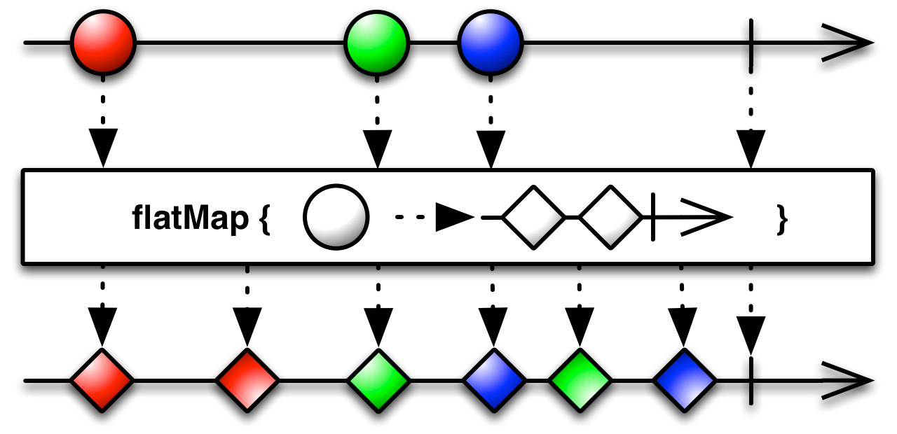

---

layout: ribbon

style: |

    @media screen .full .progress div {
      height: 6px;
    }
    div.footer {
      position:absolute;
      right: 0;
      bottom: 16px;
      right: 16px;
      z-index: 1;
      font-size:15px;
      font-family: 'PT Sans Narrow', sans-serif;
      color: #888;
    }
    #Cover h2 {
        margin:30px 0 0;
        color:#FFF;
        text-align:center;
        font-size:70px;
        text-shadow: 2px 2px #888888;
        margin-top: 392px;
        }
    #Cover p {
        margin:10px 0 0;
        text-align:center;
        color:#FFF;
        font-style:italic;
        font-size:20px;
        }
    #Cover p a {
        color:#FFF;
        }
    #Cover div {
        height: 640px;
        }
    #cover h2 {
    }
    #Cover em {
        text-shadow: 2px 2px #888888;
    }
    #Picture h2 {
        color:#FFF;
        }
    #SeeMore h2 {
        font-size:100px
        }
    #SeeMore img {
        width:0.72em;
        height:0.72em;
        }
    .slide>div {
        padding-top:25px;
        height: 545px;
    }
    .slide pre code {
        line-height: 35px;
    }
    .slide.smallSize pre code {
        line-height: 25px;
        font-size: 18px;
    }
    .slide:after {
        background: none;
    }
    img[alt=marble] { width: 750px; }
    img[alt=right] { float: right; }
    .slide pre mark {
      padding-left: 0;
      padding-right: 0;
    }
    .slide pre mark.comment span {
      padding: 0;
      background: 0 0;
      color: #999;
    }
    .ego img {
      vertical-align: middle;
      margin-right: 4px;
    }
    .ego a {
      border-bottom: 0px;
      color: #666666;
    }
    .slide.top100 pre, .slide.top100 p, .slide.top100 ul { margin-top: 100px; }
    .slide.top120 pre, .slide.top120 p, .slide.top120 ul { margin-top: 120px; }
    .slide.top170 pre, .slide.top170 p, .slide.top170 ul { margin-top: 170px; }
    .demo p {
      margin: 0;
      text-align: center;
    }
    .demo p a {
      border-bottom: 0px;
      color: #666666;
    }
    #13 rxJava
    #25 flatMap
    #34 subscription
---

# Introduction to Retrofit and RxJava {#Cover}

<!-- photo by John Carey, fiftyfootshadows.net -->

## Ego slide

<a href="https://twitter.com/fabioCollini">@fabioCollini</a>

<a href="http://linkedin.com/in/fabiocollini">linkedin.com/in/fabiocollini</a>

<a href="http://www.folderorganizer.net/">Folder Organizer</a>

<a href="http://www.cosenonjaviste.it">cosenonjaviste.it</a>

<a href="http://nanabianca.it/">nana bianca</a>

<a href="http://freapp.com/">Freapp</a>

<a href="http://instal.com">instal.com</a>

<a href="https://play.google.com/store/apps/details?id=com.willitraintomorrow">Rain tomorrow?</a>

## Retrofit
{:.top100}

- Turns your REST API into a Java interface
- Simple to use
- JSON conversion using Gson
- Custom converters
- &nbsp;...

## RxJava
{:.top100}

<figure markdown="1">

> 
RxJava is a Java VM implementation of ReactiveX (Reactive Extensions): a library for composing asynchronous and event-based programs by using observable sequences.

<figcaption>github.com/ReactiveX/RxJava</figcaption>
</figure>

## RxJava is not simple...

## Demo project
{:.demo}

[github.com/fabioCollini/IntroToRetrofitRxJava](https://github.com/fabioCollini/IntroToRetrofitRxJava/)

## HTTP request definition

    public interface StackOverflowService {

      @GET("/users")
      UserResponse getTopUsers();

    }

## HTTP request definition

    public interface StackOverflowService {

      @GET("/users")
      UserResponse getTopUsers();

    }

    public class UserResponse {
      private List<User> items;
      public List<User> getItems() {
        return items;
      }
    }

## Service creation

    RestAdapter restAdapter = 
      new RestAdapter.Builder()

## Service creation

    RestAdapter restAdapter = 
      new RestAdapter.Builder()
      <mark>.setEndpoint("http://api.stackexchange.com/2.2/")</mark>

## Service creation

    <mark>RestAdapter restAdapter</mark> = 
      new RestAdapter.Builder()
      .setEndpoint("http://api.stackexchange.com/2.2/")
      <mark>.build();</mark>

## Service creation

    RestAdapter restAdapter = 
      new RestAdapter.Builder()
      .setEndpoint("http://api.stackexchange.com/2.2/")
      .build();
    <mark>StackOverflowService service = </mark>
      <mark>restAdapter.create(StackOverflowService.class);</mark>

## Service creation

    RestAdapter restAdapter = 
      new RestAdapter.Builder()
      .setEndpoint("http://api.stackexchange.com/2.2/")
      <mark>.setRequestInterceptor(request -> {</mark>
        <mark>request.addQueryParam("site", "stackoverflow");</mark>
        <mark>request.addQueryParam("key", "...");</mark>
      <mark>})</mark>
      .build();
    StackOverflowService service =
      restAdapter.create(StackOverflowService.class);

## Synchronous request
{:.top120}

    private List<User> loadItemsSync() {
      List<User> users = 
        <mark>service.getTopUsers()</mark>.getItems();
      if (users.size() > 5) {
        users = users.subList(0, 5);
      }
      return users;
    }

## Request parameters

    @GET("/users/<mark>{userId}</mark>/top-tags") 
    TagResponse getTags(@Path("userId") int <mark>userId</mark>);
  
    @GET("/users/<mark>{userId}</mark>/badges") 
    BadgeResponse getBadges(@Path("userId") int <mark>userId</mark>);

## Request parameters

    @GET("/users/{userId}/top-tags") 
    TagResponse getTags(@Path("userId") int userId);
  
    @GET("/users/{userId}/badges") 
    BadgeResponse getBadges(@Path("userId") int userId);

service.getTags(<mark>12345</mark>);

/users/<mark>12345</mark>/top-tags?site=stackoverflow&key=...

## Other annotations

- @GET, @POST, @PUT, @DELETE, @HEAD
- @Path
- @Query
- @QueryMap
- @Body
- @FormUrlEncoded
- @Field
- @Headers

## Composition

    List<User> users = service.<mark>getTopUsers</mark>().getItems();
    if (users.size() > 5) {
      users = users.subList(0, 5);
    }
    List<UserStats> statsList = new ArrayList<>();
    for (User user : users) {
      TagResponse tags = 
        service.<mark>getTags</mark>(user.getId());
      BadgeResponse badges = 
        service.<mark>getBadges</mark>(user.getId());
      statsList.add(new UserStats(user, 
        tags.getItems(), badges.getItems()));
    }
    return statsList;

## AsyncTask
{:.smallSize}

    new AsyncTask<Void, Void, List<User>>() {
      @Override 
      protected List<User> doInBackground(Void... p) {
        try {
          return <mark>loadItemsSync();</mark>
        } catch (Exception e) {
          return null;
        }
      }
      @Override
      protected void onPostExecute(List<User> users) {
        if (users != null) {
          <mark>adapter.addAll(users);</mark>
        } else {
          <mark>showError();</mark>
        }
      }
    }.execute();

## Synchronous request
{:.top120}

    public interface StackOverflowService {

      @GET("/users")
      <mark>UserResponse</mark> getTopUsers();

    }

## Callbacks
{:.top120}

    public interface StackOverflowService {

      @GET("/users") 
      void getTopUsers(<mark>Callback<UserResponse> callback</mark>);

    }

## Callbacks in action

    service.getTopUsers(new Callback<UserResponse>() {
      @Override public void success(
          UserResponse userResponse, Response r) {
        <mark>List<User> users = userResponse.getItems();</mark>
        <mark>if (users.size() > 5)</mark>
        <mark>  users = users.subList(0, 5);</mark>
        <mark>adapter.addAll(users);</mark>
      }
      @Override public void failure(RetrofitError e) {
        showError();
      }
    });

## Callbacks in action

    service.getTopUsers(new Callback<UserResponse>() {
      @Override public void success(
          UserResponse userResponse, Response r) {
        List<User> users = userResponse.getItems();
        if (users.size() > 5)
          users = users.subList(0, 5);
        adapter.addAll(users);
      }
      @Override public void failure(RetrofitError e) {
        <mark>showError();</mark>
      }
    });

## Callback hell
{:.smallSize}

    service.getBadges(userId, new Callback<BadgeResponse>() {
      @Override public void success(BadgeResponse badges, Response r) {
        service.getTags(userId, new Callback<TagResponse>() {
          @Override public void success(TagResponse tags, Response r) {
            callback.success(new UserStats(user, 
              tags.getItems(), badges.getItems()), r);
          }

          @Override public void failure(RetrofitError error) {
            callback.failure(error);
          }
        });
      }

      @Override public void failure(RetrofitError error) {
        callback.failure(error);
      }
    });

## Retrofit
{:.top120}

    public interface StackOverflowService {

      @GET("/users") 
      void getTopUsers(<mark>Callback<UserResponse> callback</mark>);

    }

## Retrofit + RxJava
{:.top120}

    public interface StackOverflowService {

      @GET("/users")
      <mark>Observable<UserResponse></mark> getTopUsers();

    }

## RxJava in action

    service.<mark>getTopUsers()</mark>
      .<mark>subscribe</mark>(new Action1<UserResponse>() {
        @Override public void call(UserResponse r) {
          <mark>List<User> users = r.getItems();</mark>
          <mark>if (users.size() > 5)</mark>
            <mark>users = users.subList(0, 5);</mark>
          <mark>adapter.addAll(users);</mark>
        }
      }, new Action1<Throwable>() {
        @Override public void call(Throwable t) {
          <mark>showError();</mark>
        }
      });

## Java 8 / Retrolambda
{:.top100}

    service.<mark>getTopUsers()</mark>
        .<mark>subscribe</mark>(
          r -> {
            <mark>List<User> users = r.getItems();</mark>
            <mark>if (users.size() > 5)</mark>
              <mark>users = users.subList(0, 5);</mark>
            <mark>adapter.addAll(users);</mark>
          }, 
          t -> <mark>showError()</mark>
        );

## Threading

    service
        .getTopUsers()
        <mark>.subscribeOn(Schedulers.io())</mark>
        <mark>.observeOn(AndroidSchedulers.mainThread())</mark>
        .subscribe(
          r -> {
            List<User> users = r.getItems()
            if (users.size() > 5)
              users = users.subList(0, 5);
            adapter.addAll(users);
          }, 
          t -> showError()
        );

## subscribe
{:.top170}

    public final Subscription subscribe(
      final Action1<? super T> <mark>onNext</mark>, 
      final Action1<Throwable> <mark>onError</mark>) {
        //...
    }

## onNext | onError
{:.top120}

## onNext* (onComplete | onError)?
{:.top120}

## Observable creation

    Observable.just(1, 2, 3);

## Observable creation

    Observable.just(1, 2, 3);
    Observable.from(Arrays.asList("A", "B", "C", "D"));

## Observable creation

    Observable.just(1, 2, 3);
    Observable.from(Arrays.asList("A", "B", "C", "D"));
    Observable.error(new IOException());

## Observable creation

    Observable.just(1, 2, 3);
    Observable.from(Arrays.asList("A", "B", "C", "D"));
    Observable.error(new IOException());
    Observable.interval(5, TimeUnit.SECONDS);

## Observable creation

    Observable.just(1, 2, 3);
    Observable.from(Arrays.asList("A", "B", "C", "D"));
    Observable.error(new IOException());
    Observable.interval(5, TimeUnit.SECONDS);
    Observable.create(subscriber -> {
      try {
        subscriber.onNext(createFirstValue());
        subscriber.onNext(createSecondValue());
        subscriber.onCompleted();
      } catch (Throwable t) {
        subscriber.onError(t);
      }
    });

## Observable in action

    public Subscription subscribe(
      Action1<? super T> onNext, 
      Action1<Throwable> onError, 
      Action0 onComplete
    );

## Observable in action

    public Subscription subscribe(
      Action1<? super T> onNext, 
      Action1<Throwable> onError, 
      Action0 onComplete
    );

    Observable.just(1, 2, 3).subscribe(
        System.out::println, 
        Throwable::printStackTrace, 
        () -> System.out.println("Completed")
      );

## Observer

    Observable.just(1, 2, 3)
      .subscribe(new Observer<Integer>() {
          @Override public void onNext(Integer i) {
              System.out.println(i);
          }
          @Override public void onError(Throwable t) {
              t.printStackTrace();
          }
          @Override public void onCompleted() {
              System.out.println("Completed");
          }
      });

## map
{:.top100}

## map

    service.getTopUsers()
      .subscribe(
        r -> {
          List<User> users = r.getItems()
          if (users.size() > 5)
            users = users.subList(0, 5);
          adapter.addAll(users);
        }, 
        t -> showError()
      );

## map

    service.getTopUsers()
      <mark>.map(r -> r.getItems())</mark>
      .subscribe(
        users -> {
          if (users.size() > 5)
            users = users.subList(0, 5);
          adapter.addAll(users);
        }, 
        t -> showError()
      );

## map

    service.getTopUsers()
      .map(r -> r.getItems())
      <mark>.map(users -> users.size() > 5 ?</mark> 
          <mark>users.subList(0, 5) : users)</mark>
      .subscribe(
        users -> adapter.addAll(users), 
        t -> showError()
      );

## map

    service.getTopUsers()
      .map(<mark>UserResponse::getItems</mark>)
      .map(users -> users.size() > 5 ?
          users.subList(0, 5) : users)
      .subscribe(
        <mark>adapter::addAll</mark>, 
        t -> showError()
      );

## zip

## zip
{:.top100}

    Observable.zip(
        <mark class="comment">service.getTags(user.getId()),</mark>
        <mark class="comment">service.getBadges(user.getId()),</mark>
        <mark class="comment">(tags, badges) -> </mark>
        <mark class="comment">  new UserStats(</mark>
        <mark class="comment">    user, tags.getItems(), badges.getItems())</mark>
        <mark class="comment">  )</mark>
    );        

## zip
{:.top100}

    Observable.zip(
        <mark>service.getTags(user.getId()),</mark>
        <mark class="comment">service.getBadges(user.getId()),</mark>
        <mark class="comment">(tags, badges) -> </mark>
        <mark class="comment">  new UserStats(</mark>
        <mark class="comment">    user, tags.getItems(), badges.getItems())</mark>
        <mark class="comment">  )</mark>
    );        

## zip
{:.top100}

    Observable.zip(
        service.getTags(user.getId()),
        <mark>service.getBadges(user.getId()),</mark>
        <mark class="comment">(tags, badges) -> </mark>
        <mark class="comment">  new UserStats(</mark>
        <mark class="comment">    user, tags.getItems(), badges.getItems())</mark>
        <mark class="comment">  )</mark>
    );        

## zip
{:.top100}

    Observable.zip(
        service.getTags(user.getId()),
        service.getBadges(user.getId()),
        <mark>(tags, badges) -> </mark>
        <mark>  new UserStats(</mark>
        <mark>    user, tags.getItems(), badges.getItems())</mark>
        <mark>  )</mark>
    );        

## zip
{:.top100}

    Observable.zip(
        service.<mark>getTags</mark>(user.getId()),
        service.<mark>getBadges</mark>(user.getId()),
        (tags, badges) -> 
          new UserStats(
            user, tags.getItems(), badges.getItems()
          )
    );        

## zip
{:.top100}

    Observable.zip(
        service.<mark>getTags</mark>(user.getId())
          .map(TagResponse::getItems),
        service.<mark>getBadges</mark>(user.getId())
          .map(BadgeResponse::getItems),
        (tags, badges) -> 
          new UserStats(user, tags, badges)
    );        

## Multi value map

        Observable.just(1, 2, 3).<mark>map</mark>(
            i -> Observable.just(i * 10, i * 10 + 1)
        );

## Multi value map

    <mark>Observable<Observable<Integer>></mark> observable =
        Observable.just(1, 2, 3).<mark>map</mark>(
            i -> Observable.just(i * 10, i * 10 + 1)
        );

## Multi value map

    Observable<Observable<Integer>> observable =
        Observable.just(1, 2, 3).map(
            i -> Observable.just(i * 10, i * 10 + 1)
        );

    [1, 2, 3]

    [[10, 11], [20, 21], [30, 31]]

## flatMap
{:.top100}

## flatMap
{:.top120}

    <mark>Observable<Integer></mark> observable =
        Observable.just(1, 2, 3).<mark>flatMap</mark>(
            i -> Observable.just(i * 10, i * 10 + 1)
        );

    [1, 2, 3]

    [10, 11, 20, 21, 30, 31]

## flatMap
{:.top120}

    Observable<Profile> observable = 
      service.<mark>login</mark>(userName, password)
        .flatMap(token -> service.<mark>getProfile</mark>(token));

## flatMap
{:.top120}

    <mark class="comment">Observable<Profile> observable = </mark>
    <mark class="comment">  service.login(userName, password)</mark>
    <mark class="comment">    .flatMap(token -> service.getProfile(token));</mark>

    Observable<Profile> observable = 
      service.<mark>login</mark>(userName, password)
        .flatMap(service::<mark>getProfile</mark>);

## flatMap
{:.top120}

    service
      .getTopUsers()//1<UserResponse>

## flatMap
{:.top120}

    service
      .getTopUsers()//1<UserResponse>
      .flatMap(r -> Observable.from(r.getItems()))
      //20<User>

## flatMap
{:.top120}

    service
      .getTopUsers()//1<UserResponse>
      .flatMapIterable(UserResponse::getItems)//20<User>

## flatMap
{:.top120}

    service
      .getTopUsers()//1<UserResponse>
      .flatMapIterable(UserResponse::getItems)//20<User>
      .limit(5)//5<User>

## flatMap
{:.top120}

    service
      .getTopUsers()//1<UserResponse>
      .flatMapIterable(UserResponse::getItems)//20<User>
      .limit(5)//5<User>
      .flatMap(this::loadUserStats)//5<UserStats>

## flatMap
{:.top120}

    service
      .getTopUsers()//1<UserResponse>
      .flatMapIterable(UserResponse::getItems)//20<User>
      .limit(5)//5<User>
      .flatMap(this::loadUserStats)//5<UserStats>
      .toList();//1<List<UserStats>>

## Order is not preserved
{:.demo}

## flatMap source code
{:.top120}

    public final <R> Observable<R> flatMap(
          Func1<
            ? super T, 
            ? extends Observable<? extends R>
          > func) {
      <mark>return merge(map(func));</mark>
    }

## concatMap
{:.top100}

## concatMap source code
{:.top120}

    public final <R> Observable<R> concatMap(
          Func1<
            ? super T, 
            ? extends Observable<? extends R>
          > func) {
        <mark>return concat(map(func));</mark>
    }

## concatMap
{:.top120}

    service
        .getTopUsers()
        .flatMapIterable(UserResponse::getItems)
        .limit(5)
        .<mark>concatMap</mark>(this::loadUserStats)
        .toList();

## timeout
{:.top120}

    service
        .getTopUsers()
        .flatMapIterable(UserResponse::getItems)
        .limit(5)
        .concatMap(this::loadRepoStats)
        .toList()
        .<mark>timeout(20, TimeUnit.SECONDS)</mark>;

## retry
{:.top120}

    service
        .getTopUsers()
        .<mark>retry(2)</mark>
        .flatMapIterable(UserResponse::getItems)
        .limit(5)
        .concatMap(this::loadRepoStats)
        .toList()
        .timeout(20, TimeUnit.SECONDS)
        .<mark>retry(1)</mark>;

## Cache

    public class Cache {
      private List<UserStats> items;
      public void save(List<UserStats> users) {
        items = users;
      }
      public Observable<List<UserStats>> load(
          Throwable t) {
        if (items == null)
          return Observable.error(t);
        else
          return Observable.just(items);
      }
    }

## doOnNext / onErrorResumeNext
{:.top100}

    service.getTopUsers()
        .retry(2)
        .flatMapIterable(UserResponse::getItems)
        .limit(5)
        .concatMap(this::loadRepoStats)
        .toList()
        .timeout(20, TimeUnit.SECONDS)
        .retry(1)
        .<mark>doOnNext(cache::save)</mark>
        .<mark>onErrorResumeNext(cache::load)</mark>;

## Subscription

    Observable
      .<mark>interval</mark>(1, TimeUnit.SECONDS)
      .timestamp()
      .subscribe(System.out::println);

## Subscription

    Subscription <mark>subscription</mark> = Observable
      .interval(1, TimeUnit.SECONDS)
      .timestamp()
      .subscribe(System.out::println);

    Thread.sleep(2500);

    subscription.<mark>unsubscribe</mark>();

## Subscription

    Subscription subscription = Observable
      .interval(1, TimeUnit.SECONDS)
      .timestamp()
      .subscribe(System.out::println);

    Thread.sleep(2500);

    subscription.unsubscribe();

Timestamped(timestampMillis = 142936040<mark>6</mark>807, value = <mark>0</mark>)
Timestamped(timestampMillis = 142936040<mark>7</mark>805, value = <mark>1</mark>)

## How many requests?

    Observable<UserResponse> observable = 
      service.<mark>getTopUsers</mark>();

    Subscription s1 = observable.<mark>subscribe</mark>(
      System.out::println, Throwable::printStackTrace);
    Subscription s2 = observable.<mark>subscribe</mark>(
      System.out::println, Throwable::printStackTrace);

## How many requests?

    Observable<UserResponse> observable = 
      service.<mark>getTopUsers</mark>();

    Subscription s1 = observable.<mark>subscribe</mark>(
      System.out::println, Throwable::printStackTrace);
    Subscription s2 = observable.<mark>subscribe</mark>(
      System.out::println, Throwable::printStackTrace);

- 2 requests
- Retrofit Observables are <mark>cold</mark>

## Hot observables

    Observable<UserResponse> observable = 
      service.<mark>getTopUsers</mark>();

    ConnectableObservable<UserResponse> replayObservable
      = observable.<mark>replay(1)</mark>;

    Subscription s1 = replayObservable.subscribe(
      System.out::println, Throwable::printStackTrace);
    Subscription s2 = replayObservable.subscribe(
      System.out::println, Throwable::printStackTrace);

    Subscription s3 = replayObservable.<mark>connect</mark>();

## Activity lifecycle

    @Override public View onCreateView(...) {
      ...
      retainedFragment = RetainedFragment
        .getOrCreate(getActivity());

      if (retainedFragment.get() == null) {
        Observable<List<T>> observable = loadItems()
            .subscribeOn(Schedulers.io())
            .observeOn(AndroidSchedulers.mainThread());
        retainedFragment.<mark>bind</mark>(observable.<mark>replay(1)</mark>);
      }
      ...
    }

## Activity lifecycle

    @Override public void <mark>onResume</mark>() {
      super.onResume();
      subscription = retainedFragment.get()
        .<mark>subscribe</mark>(
          this::showDataInList, 
          t -> showError()
        );
    }

    @Override public void <mark>onPause</mark>() {
      super.onPause();
      subscription.<mark>unsubscribe</mark>();
    }

## RetainedFragment
{:.smallSize}

    public class RetainedFragment<T> extends Fragment {
      private Subscription connectableSubscription = Subscriptions.empty();
      private ConnectableObservable<T> observable;
      public RetainedFragment() {
          <mark>setRetainInstance(true);</mark>
      }
      public void bind(ConnectableObservable<T> observable) {
          this.observable = observable;
          connectableSubscription = observable.connect();
      }
      @Override public void onDestroy() {
          super.onDestroy();
          connectableSubscription.unsubscribe();
      }
      public Observable<T> get() {
          return observable;
      }
    }    

## RetainedFragment
{:.smallSize}

    public class RetainedFragment<T> extends Fragment {
      private Subscription connectableSubscription = Subscriptions.empty();
      private ConnectableObservable<T> observable;
      public RetainedFragment() {
          <mark>setRetainInstance(true);</mark>
      }
      public void bind(ConnectableObservable<T> observable) {
          this.observable = observable;
          connectableSubscription = <mark>observable.connect();</mark>
      }
      @Override public void onDestroy() {
          super.onDestroy();
          connectableSubscription.unsubscribe();
      }
      public Observable<T> get() {
          return observable;
      }
    }    

## RetainedFragment
{:.smallSize}

    public class RetainedFragment<T> extends Fragment {
      private Subscription connectableSubscription = Subscriptions.empty();
      private ConnectableObservable<T> observable;
      public RetainedFragment() {
          <mark>setRetainInstance(true);</mark>
      }
      public void bind(ConnectableObservable<T> observable) {
          this.observable = observable;
          connectableSubscription = <mark>observable.connect();</mark>
      }
      @Override public void onDestroy() {
          super.onDestroy();
          <mark>connectableSubscription.unsubscribe();</mark>
      }
      public Observable<T> get() {
          return observable;
      }
    }    

## Thanks for your attention!

Questions?

&nbsp;

<a href="https://github.com/fabioCollini/IntroToRetrofitRxJava/">github.com/fabioCollini/IntroToRetrofitRxJava</a>

&nbsp;

<a href="https://twitter.com/fabioCollini">@fabioCollini</a>

<a href="http://linkedin.com/in/fabiocollini">linkedin.com/in/fabiocollini</a>

<a href="http://www.cosenonjaviste.it">cosenonjaviste.it</a>

